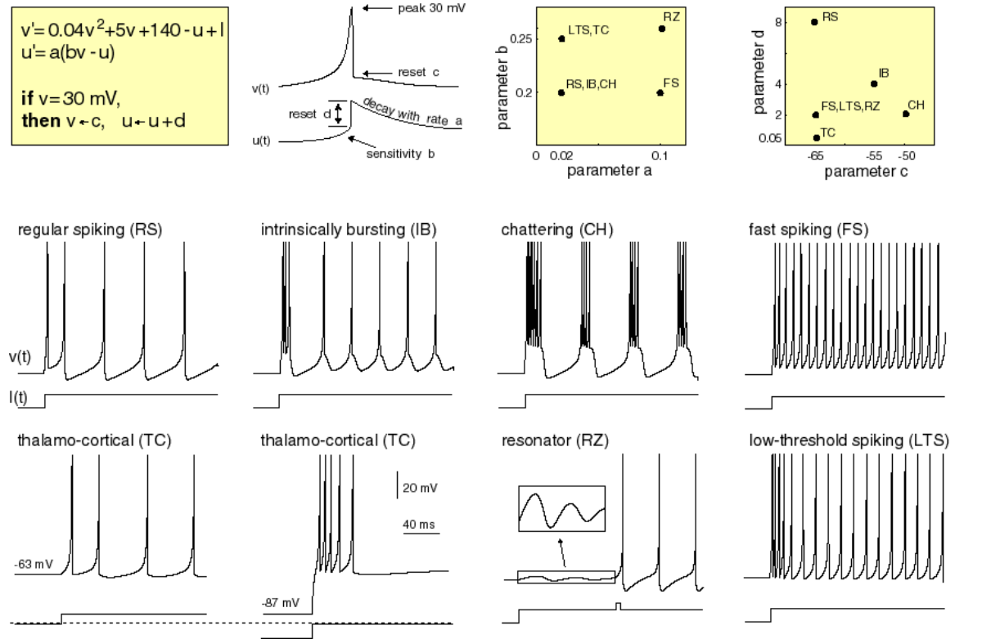

# Izhikevich Neuron RTL

A synthesizable **Verilog RTL implementation of the Izhikevich spiking neuron model** using fixed-point arithmetic.

The design models biologically realistic neuron behavior including:

- membrane potential integration  
- spike generation  
- recovery dynamics  
- refractory period  

The implementation demonstrates neuron responses to:

- constant current input  
- ramp input current  
- real ECG waveform input  

This project illustrates how **neuromorphic neuron models can be implemented efficiently in digital hardware** for FPGA-based **Spiking Neural Networks (SNNs)**.

---

# Overview

Neuromorphic computing aims to emulate biological neural systems in hardware.

Unlike traditional artificial neural networks, **Spiking Neural Networks (SNNs)** communicate using **discrete spike events** instead of continuous activations.

The **Izhikevich neuron model** is widely used because it can reproduce many neuron firing patterns while remaining computationally efficient.

This repository implements the neuron in **hardware-friendly fixed-point RTL**, making it suitable for digital design and FPGA implementation.

---

# Mathematical Model

The Izhikevich neuron is governed by two differential equations:

dv/dt = 0.04v² + 5v + 140 − u + I  
du/dt = a(bv − u)

Spike condition:

if v ≥ threshold  
  v = c  
  u = u + d

Where:

| Parameter | Description |
|----------|-------------|
| v | Membrane potential |
| u | Recovery variable |
| I | Input current |
| a, b, c, d | Neuron parameters controlling firing behavior |

---

# Hardware Implementation

The neuron is implemented using **fixed-point arithmetic** for efficient digital hardware synthesis.

Main hardware blocks:

- Fixed-point datapath
- Signed multiplier module
- Membrane potential update logic
- Recovery variable update logic
- Spike detection comparator
- Refractory period counter

The design is **fully synthesizable** and compatible with FPGA tools such as **Xilinx Vivado**.

---

# Neuron Firing Patterns

The Izhikevich neuron model can reproduce a wide variety of biologically observed firing behaviors by adjusting four parameters:

**a, b, c, and d**

Typical parameter ranges:

- **a:** 0 → 0.1  
- **b:** 0 → 0.3  
- **c:** −0.70 → −0.50  
- **d:** 0.0005 → 0.08  

### Example Parameter Sets

| Neuron Type | a | b | c | d |
|-------------|---|---|---|---|
| Regular Spiking | 0.02 | 0.2 | -65 | 8 |
| Intrinsically Bursting | 0.02 | 0.2 | -55 | 4 |
| Chattering | 0.02 | 0.2 | -50 | 2 |
| Fast Spiking | 0.1 | 0.2 | -65 | 2 |
| Thalamo-Cortical | 0.02 | 0.25 | -65 | 0.05 |
| Resonator | 0.1 | 0.26 | -65 | 2 |
| Low Threshold Spiking | 0.02 | 0.25 | -65 | 2 |

### Reference Spike Patterns

Reference image from Cornell University Neuromorphic Computing Lab:  
https://people.ece.cornell.edu/land/courses/ece5760/DDA/NeuronIndex.htm

---

# Testbenches

Three testbenches are provided to verify neuron behavior under different input conditions.

---

## Constant Current Input

Tests neuron firing behavior under a constant input current.

Observed signals:

- input current (I)
- membrane potential (v)
- recovery variable (u)
- spike output

Waveform results available in:
waveforms/constant_current_input_tb_results

---

## Ramp Input Test

Gradually increases the input current to observe neuron activation threshold.

This test demonstrates:

- neuron activation threshold  
- spike generation  
- membrane potential dynamics  

Waveform results available in:
waveforms/ramp_input_results

---

## ECG Signal Input

Real ECG waveform samples are used as neuron input.

Two neuron instances are simulated:

- neuron with **normal ECG input**
- neuron with **inverted ECG input**

This demonstrates how spiking neurons convert continuous biomedical signals into **spike trains**.

ECG data files:
data/ecg_q3_16_record202.mem
data/ecg_q3_16_record202_inverted.mem

Waveform results:
waveforms/ecg_input_results

---

# Simulation

The design can be simulated using:

- **Xilinx Vivado Simulator**
- ModelSim
- any standard Verilog simulator

Typical signals to observe:

- clk
- I
- v
- u
- spike

Expected behavior:

- membrane potential integrates input current
- when threshold is crossed → spike generated
- refractory period prevents immediate re-spiking

---

# Fixed-Point Representation

The neuron uses **Q3.16 fixed-point format**.

Example values used:

| Decimal | Fixed-Point |
|-------|-------------|
| 0.02 | 18'sh051E |
| 0.2 | 18'sh3333 |
| -0.65 | 18'sh3599A |

This enables efficient hardware implementation while maintaining numerical precision.

---

# Tools Used

- Verilog HDL  
- Xilinx Vivado Simulator  

---

# References

E. M. Izhikevich  
**Simple Model of Spiking Neurons**  
IEEE Transactions on Neural Networks, 2003

Cornell Neuromorphic Computing Lab  
https://people.ece.cornell.edu/land/courses/ece5760/DDA/NeuronIndex.htm

---

# Author

**Sai Ram Lingamsetty**

ECE – Digital Design | Neuromorphic Hardware  
